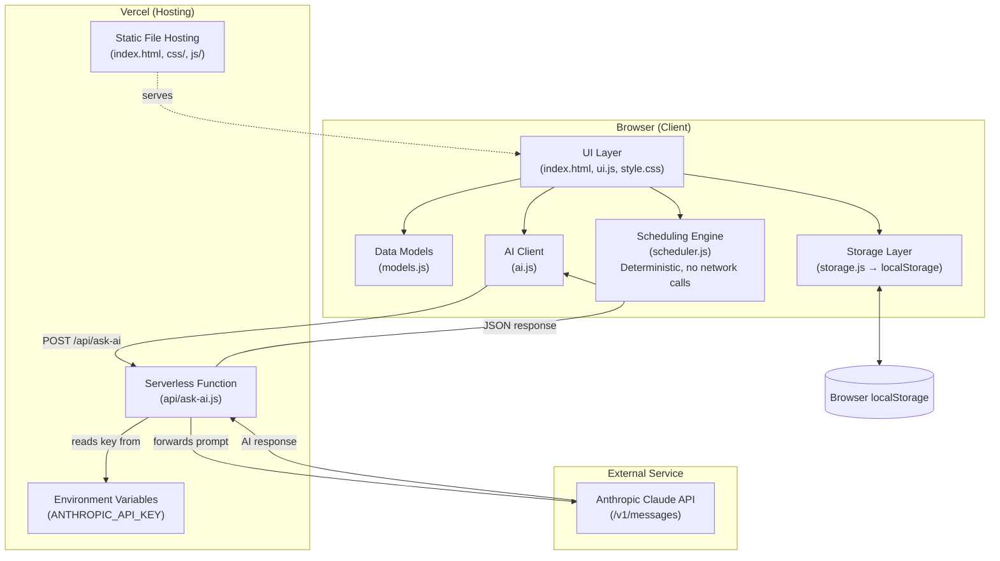
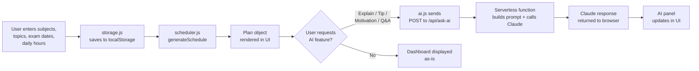
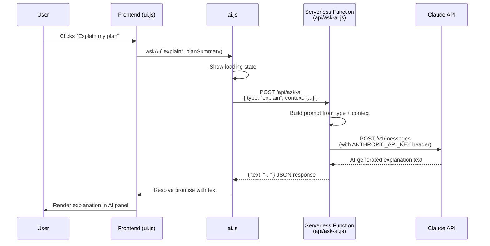

# AI Study Planner — Architecture

_Day 2 deliverable — Source of truth for system design. Do not deviate without flagging a conflict with the PRD._

## 1. Component Diagram

**Key design principle:** the Claude API key exists only inside the Vercel serverless function's environment variables. It is never sent to, stored in, or accessible from the browser.

## 2. Data Flow

## 3. Request Lifecycle (AI Feature Example: "Explain my plan")

## 4. AI Interaction Model

The AI layer is **additive, not load-bearing** — if the Claude API is unreachable, the core scheduling and dashboard experience still works perfectly. Four distinct prompt "types" are handled by one serverless function:

| Type | Trigger | Input Context | Output |
|---|---|---|---|
| `explain` | User clicks "Explain my plan" | Plan summary (subjects, priorities, revision days) | 2–3 sentence plain-language explanation |
| `tip` | Loads automatically on dashboard view | Today's subjects/topics | One short, specific study tip |
| `motivation` | Loads automatically on dashboard view | Days remaining until nearest exam | One short motivational message |
| `qa` | User submits a question in the Q&A box | Free-text question + current plan as context | Direct, brief answer |

All four share the same request/response contract (see `API.md`), differing only in the `type` field and the `context` payload shape.

## 5. External Services

| Service | Purpose | Notes |
|---|---|---|
| Anthropic Claude API | Powers all AI features | Called exclusively server-side; free-tier-compatible usage (low request volume expected for a personal-use v1.0) |
| Vercel | Hosting (static + serverless) | Free Hobby tier; GitHub-connected for auto-deploy |
| GitHub | Source control + CI trigger | Existing `60-days-Claude-Challenge` repo, `Day51/` subfolder |

## 6. Why No Database / No Auth (Reaffirmed)

Per the approved PRD, v1.0 explicitly excludes accounts and cloud storage to keep the 1–2 hr/day timeline realistic for a first-time full-stack builder. `localStorage` fully satisfies the "persist across visits on the same device" requirement (FR-13). This is revisited only in future scope (multi-device sync).
